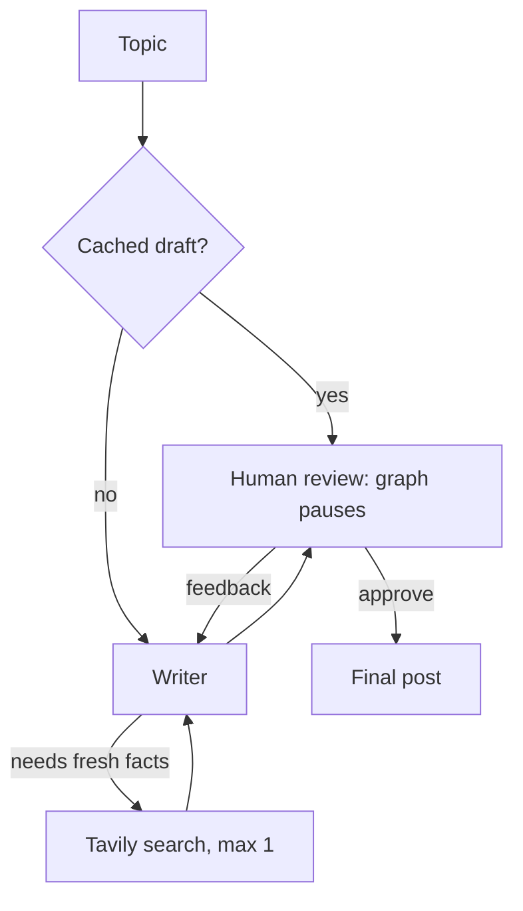

# ✈️ PostPilot

### AI drafts. You decide.

An AI writer that researches the web, drafts a LinkedIn post, and **waits for your approval** before anything is final.

## 🚀 Live demo

**👉 [pilotpost-generator.streamlit.app](https://pilotpost-generator.streamlit.app/)**

**Hiring manager? Test it in 60 seconds:**

1. Pick a topic (or click an example)
2. Review the AI's draft
3. Type feedback to get a rewrite, or approve it

> It's a free-tier demo, so each visitor gets a few runs. You can paste your own Groq API key in the sidebar for unlimited use.

<!-- Add a screenshot or GIF here:  -->

## ✨ Features

- **Human-in-the-loop approval:** the graph pauses with LangGraph's `interrupt()` and resumes with your decision. Nothing is final until you approve.
- **Agentic web search:** the writer decides whether it needs fresh facts and calls Tavily (max 1 search per post).
- **Feedback loop:** your feedback goes back to the writer, which rewrites using the previous draft plus your comments.
- **Live progress:** each graph node is streamed to the UI while it runs.
- **Built-in cost control:** token budgets, run limits, caching and bring-your-own-key (see below).

## 🧠 How it works

- **State:** a `TypedDict` shared by all nodes (topic, research, draft, feedback, attempt, tokens used).
- **Pause and resume:** `MemorySaver` + a unique `thread_id` per visitor lets `interrupt()` stop the graph and `Command(resume=...)` continue the same run.
- **Conditional edges:** a router decides whether to loop back to the writer or finish. A second router skips the writer when a cached draft exists.
- **Streamlit reruns:** the checkpointer lives in `st.cache_resource`, so pause and resume survive Streamlit's rerun-on-every-click model.

## 🛡️ Token and quota protection

Built so a public demo can't burn through free-tier API limits:

| Level | Limit |
|---|---|
| Per visitor | 3 runs per session, 30 s cooldown between runs |
| Per post | 2 drafts, topic up to 100 characters, feedback up to 300 |
| Per run | 6,000-token cap, checked before every LLM call |
| Whole demo (all visitors) | 20 runs, 60,000 tokens and 15 searches per day |
| Cost savers | Same topic is cached (0 tokens), smaller model for the public demo, `max_tokens` cap, low reasoning effort |
| Unlimited use | Visitors can bring their own Groq key (not stored) |

When the daily quota is used up, the app shows a sample post instead of an error. All limits are constants at the top of `app.py`.

## 🛠️ Tech stack

- **[LangGraph](https://github.com/langchain-ai/langgraph):** workflow, routing, human-in-the-loop
- **[Groq](https://groq.com/):** LLM inference (`gpt-oss-20b` public demo, `gpt-oss-120b` with your own key)
- **[Tavily](https://tavily.com/):** web search
- **[Streamlit](https://streamlit.io/):** UI and hosting
- **LangChain:** model and tool integrations

## ⚠️ Known limitations

- Daily counters and the draft cache live in memory, so they reset when the app restarts or goes to sleep. For a hard daily cap, store the counters in an external database.
- The per-session run limit resets if a visitor refreshes the page. The global daily cap is the real protection.
- Posts are drafted by a small free-tier model, so quality varies by topic.
